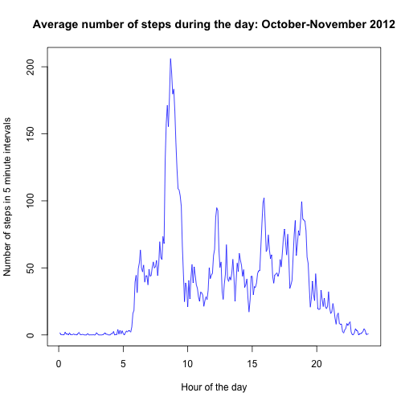

## Reproducible Research: Peer Assessment 1

Submitted as part of the December 2014 Coursera session.

This report analyses a dataset containing the number of steps taken by an individual for two months in 2012. The step counts are divided into 5 minute intervals so there are 17,568 rows in the dataset. Each row contains the number of steps per 5 minute interval, the date and an index of the time interval.


### Loading and preprocessing the data
Data is extracted assuming the project repository has been cloned to a local computer and that the repository folder is set as the current working directory.


```r
wd <- "~/repos/RepData_PeerAssessment1"  # modify as required
setwd(wd) 
data <- read.csv(unzip("activity.zip"))
data$date <- as.Date(data$date)
```


### What is mean total number of steps taken per day?

```r
steps <- aggregate(steps ~ date, data=data, sum)
hist(steps$steps, 
     main = "Histogram of total steps per day",
     xlab = "Total steps per day",
     col = "cornsilk")  # I just like the name of this colour, that's the only reason I put it in.
```

 

```r
mean_steps <- prettyNum(mean(steps$steps), digits = 1, format = "f")
median_steps <- median(steps$steps)
```

The mean number of steps per day is 10766 and the median number steps per day is 10765.

### What is the average daily activity pattern?

```r
data$time_index <- c(1:288)/12 # assign each time interval its sequential number per day.
# Divide by 12 to get the integer numbers as hours to make the x-axis labels more meaningfull.
steps <- aggregate(steps ~ time_index, data=data, mean)

plot(steps$steps ~ steps$time_index,
     xlab = "Hour of the day",
     ylab = "Number of steps in 5 minute intervals",
     main = "Average number of steps during the day: October-November 2012", 
     type = "l",
     col = "blue")
```

 
Averaging the total number of steps across the each time interval throughout the day shows regular activity between the sixth and twentieth hours of each day.

##### Now for some gratuitous speculation: 
The lack of any significant activity between midnight (0 hours) and 5-6 am shows that the subject is not a shift worker and the pattern of daily activity is consistent with a typical office worker. The period of highest average number of steps is in the mid-morning (at around 8-9am) indicating walking to either the place of work or to catch public transport. However, the lack of a similar high level at the end of the working day suggests that either the subject takes public transport in the morning and gets a ride home from work in the afternoon, or alternatively the peak activity in the morning represents a regular run or walking on a treadmill at a gym.  


```r
subset_max <- subset(steps, subset=(steps == max(steps)))  # extract the row with the maximum number of steps
max_time <- subset_max[1]*12 # multiply by 12 to convert back to 5-minute intervals
```
The 104th 5-minute interval in the day contains the highest average number of steps across the two months (206.1698113).

##### Now for even more speculation:
The maximum average step rate at is about 40 steps per minute, or less than one a second. A pace of this speed is more likely to be a brisk walk rather than a run - therefore I suggest the subject walks to catch public transport in the morning, but gets a car ride home from work. 

### Imputing missing values

##### Missing values

```r
sum(is.na(data$steps)) # calculate the number of time intervals with missing step values in dataset.
```

```
## [1] 2304
```
There are 2304 time intervals in the dataset with missing values for the step numbers. This represents 13% of the total number and these may introduce some bias into the calculations or summaries of the data.

In order to test whether the missing step values are of significance, they are replaced using the *'last occurence carried forward'* function in the 'zoo' package. This replaces each NA with the most recent non-NA prior to it, which makes sense for time series data. The only snag is that if there are no earlier non-NAs then the NA is omitted. Therefore the step measures are seeded with a nominal 1 in the first 5 minute interval, which is carried forward until the first actual number. Thereafter the NAs are infilled with the last occurence of a non-NA. 


```r
library(zoo) # required package - assumed already downloaded and installed
data[1,1] <- 1 # nominal value as first value of 'steps' to avoid them being deleted by na.locf function.
steps_locf <- na.locf(data$steps)  # each NA is replaced by the most recent non-NA prior to it using "Last Occurence Carried Forward".
data <- data[,c(-1,-4)]  # strip out old 'steps' plus added 'time_index' columns
data <- cbind(steps_locf, data) # compile data set as original, but now with NA's replaced with values.

steps_locf <- aggregate(steps_locf ~ date, data=data, sum)
hist(steps_locf$steps_locf, 
     main = "Histogram of total steps per day - imputed missing data",
     xlab = "Total steps per day",
     col = "steelblue") # this is a pretty cool name for a colour too.
```

 

```r
mean_steps_locf <- prettyNum(mean(steps_locf$steps_locf), digits = 1, format = "f")
median_steps_locf <- prettyNum(median(steps_locf$steps_locf), digits = 1, format = "f")
```

The *mean* number of steps per day using the imputed data is 9359 and the *median* number of total steps per day is 10395. 
This compares to the original mean number of 10766 and median 10765 steps per day.

The impact of imputing missing data is to slightly lower the median value, but to significantly lower the mean value of total steps per day.

Low or no step activity makes up a large proportion of each day (and night), therefore if the missing data occurs randomly through  the day and night then a greater proportion of missing values will from low activity periods - ignoring these values result in a high bias of the mean value. The median is less sensitive to outliers (or missing values) and hence does not change as much between the two datasets.

### Are there differences in activity patterns between weekdays and weekends?
